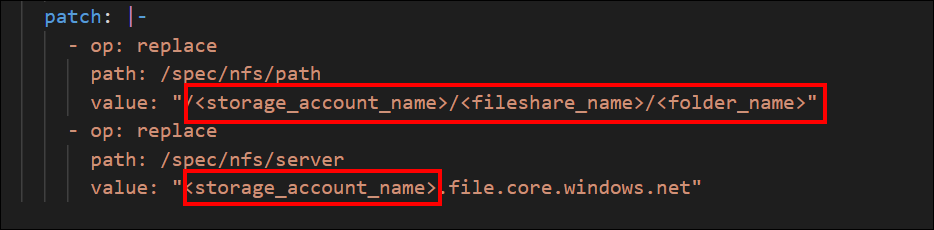
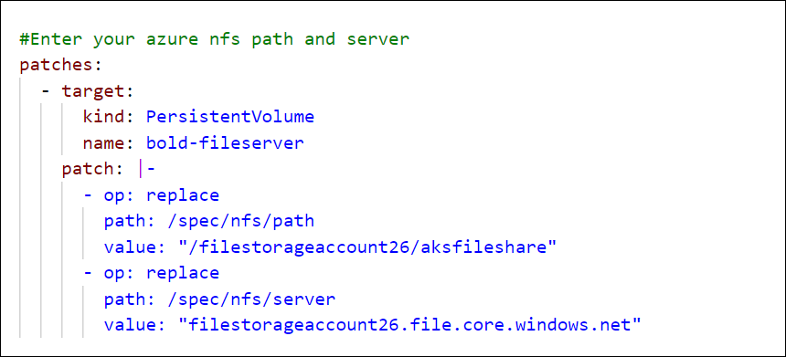
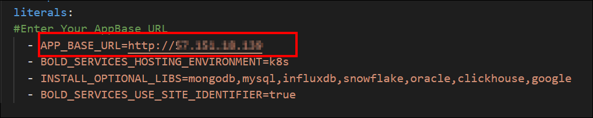
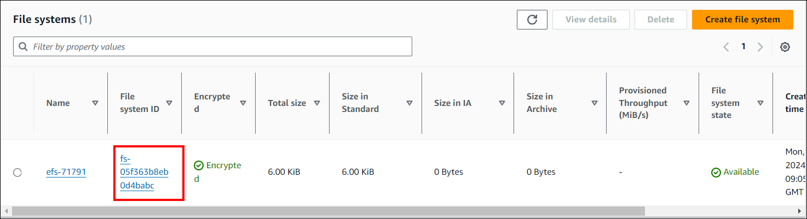
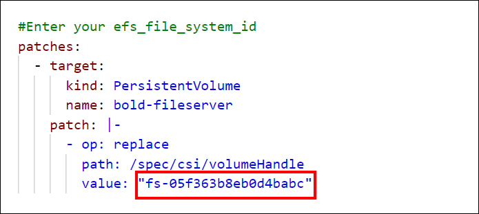
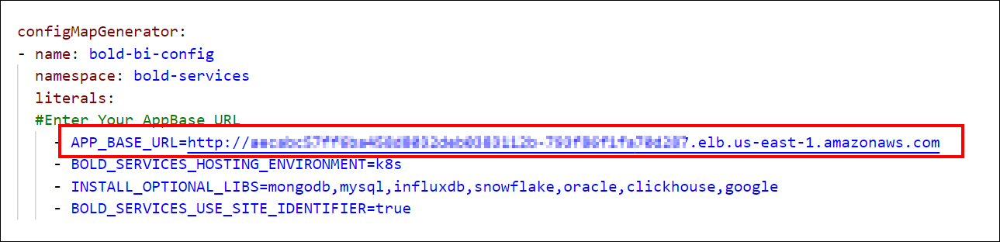

# Deploying Bold BI on Kubernetes

## Deployment Guidelines

### Prerequisites

**1. kubectl**

[Install kubectl](https://kubernetes.io/docs/tasks/tools/#kubectl), the Kubernetes command-line tool, which is used to interact with Kubernetes clusters.

**2.Kubernetes Cluster**

Every Kubernetes cluster variant comes with its unique benefits and applicable scenarios. Therefore, choose the most suitable one should be based on your specific requirements and preferences.

1. On-premises cluster 
    - [Kind Cluster](https://kind.sigs.k8s.io/docs/user/quick-start/#installation)
    - [K0s Cluster](https://docs.k0sproject.io/v1.27.2+k0s.0/install/)
    - [Rancher Desktop](https://docs.rancherdesktop.io/getting-started/installation/)
    - [Kubeadm Cluster](https://kubernetes.io/docs/setup/production-environment/tools/kubeadm/install-kubeadm/)

2.  Three cloud providers that support deploying Bold BI on Kubernetes clusters are:
    - [Azure Kubernetes Service](https://docs.microsoft.com/en-us/azure/aks/kubernetes-walkthrough-portal)
    - [Google Kubernetes Engine](https://console.cloud.google.com/kubernetes)
    - [Elastic Kubernetes Service](https://docs.aws.amazon.com/eks/latest/userguide/getting-started.html)

**3. Persistent Volume**
1. Local PV
2. [Azure NFS Fileshare](https://learn.microsoft.com/en-us/azure/storage/files/storage-how-to-use-files-portal?tabs=azure-portal)

    **NOTE:** The premium storage account of the NFS fileshare must be within the same subscription as the AKS cluster.

3. [Google Filestore](https://console.cloud.google.com/filestore)
4. [Elastic Filestore](https://docs.aws.amazon.com/efs/latest/ug/gs-step-two-create-efs-resources.html)

**4. Load Balancer**

We currently support Nginx and Istio as load balancers in Bold BI. Nginx is used as the default reverse proxy for Bold BI.

***Nginx***

1. On-premises cluster (e.g., kind, K0s Cluster, rancher, kubeadm) - Refer this [link](https://kubernetes.github.io/ingress-nginx/deploy/#rancher-desktop)

2. To configure Bold BI with Ingress, you need to install the [Nginx Ingress controller](https://kubernetes.github.io/ingress-nginx/deploy/) in your cluster. Please refer to the following instructions and execute the command accordingly.

| Cloud Provider                  | Installation Command                                                                                       |
|---------------------------------|--------------------------------------------------------------------------------------------------------|
| Azure Kubernetes Service (AKS)  | kubectl apply -f https://raw.githubusercontent.com/kubernetes/ingress-nginx/controller-v1.10.0/deploy/static/provider/cloud/deploy.yaml |
| Google Kubernetes Engine (GKE)  | kubectl apply -f https://raw.githubusercontent.com/kubernetes/ingress-nginx/controller-v1.10.0/deploy/static/provider/cloud/deploy.yaml                                         |
| Elastic Kubernetes Service (EKS)| kubectl apply -f https://raw.githubusercontent.com/kubernetes/ingress-nginx/controller-v1.10.0/deploy/static/provider/aws/deploy.yaml  |


There is an issue with the latest Nginx Ingress controller where the default value for the `allow-snippet-annotations` is set to false. To resolve this, edit the Nginx Ingress ConfigMap file and set the value to true.


Use the following command to edit the ConfigMap:
    
    kubectl edit cm ingress-nginx-controller -n ingress-nginx

Run the following command to get the ingress IP address.

    kubectl get service/ingress-nginx-controller -n ingress-nginx

***Istio***

To configure Bold BI with Istio, install the [Istio Ingress Gateway](https://istio.io/latest/docs/setup/install/) in your cluster. Please refer to the corresponding reference links for installation instructions.

| Cloud Provider                  | Reference Link                                                                                  |
|-------------|-----------------------------------------------------------------------------------------------|
| AKS Cluster | https://docs.microsoft.com/en-us/azure/aks/servicemesh-istio-install  |
| GKE Cluster | https://cloud.google.com/istio/docs/istio-on-gke/installing            |
| EKS Cluster | https://aws.amazon.com/blogs/opensource/getting-started-istio-eks/     |
| OnPremise   | https://istio.io/latest/docs/setup/platform-setup/docker/              |

Run the following command to get the ingress IP address.

    kubectl get service/istio-ingressgateway -n istio-system

Note the ingress EXTERNAL-IP address and map it with your DNS. If you do not have the DNS and want to use the application, then you can use the ingress IP address.

**5. Database**

Bold BI supports three databases for deployment on a cluster:

| Cloud Provider | Database    | Reference Link                                                                                      |
|----------------|-------------|----------------------------------------------------------------------------------------------------|
| Azure          | PostgreSQL<br><br> MS SQL<br><br> MySQL | [Azure PostgreSQL Quickstart](https://learn.microsoft.com/en-us/azure/postgresql/flexible-server/quickstart-create-server-portal)<br><br>[MS SQL Quickstart](https://learn.microsoft.com/en-us/azure/azure-sql/database/single-database-create-quickstart?view=azuresql&tabs=azure-portal)<br><br> [MySQL Quickstart](https://learn.microsoft.com/en-us/azure/mysql/flexible-server/quickstart-create-server-portal) |
| AWS            | PostgreSQL<br><br>MS SQL<br><br>MySQL | [PostgreSQL Quickstart](https://docs.aws.amazon.com/AmazonRDS/latest/UserGuide/CHAP_GettingStarted.CreatingConnecting.PostgreSQL.html)<br><br>[MS SQL Quickstart](https://docs.aws.amazon.com/AmazonRDS/latest/UserGuide/CHAP_GettingStarted.CreatingConnecting.SQLServer.html)<br><br> [MySQL Quickstart](https://docs.aws.amazon.com/AmazonRDS/latest/UserGuide/CHAP_GettingStarted.CreatingConnecting.MySQL.html) |
| GCP            | PostgreSQL<br><br>MySQL<br><br>SQL Server | [PostgreSQL Quickstart](https://cloud.google.com/sql/docs/postgres/create-instance)<br><br>[MySQL Quickstart](https://cloud.google.com/sql/docs/mysql/create-instance)<br><br>[SQL Server Quickstart](https://cloud.google.com/sql/docs/sqlserver/create-instance) |

**6. Web Browsers**

- Microsoft Edge
- Mozilla Firefox
- Google Chrome

## Deployment using kubectl
[
<kbd style="font-size: 25px; padding: 10px 20px;">AKS</kbd>
](
#deploying-bold-bi-on-microsoft-azure-kubernetes-service-aks
) [
<kbd style="font-size: 25px; padding: 10px 20px;">EKS</kbd>
](
#deploying-bold-bi-on-aws-elastic-kubernetes-service-eks
)  [
<kbd style="font-size: 25px; padding: 10px 20px;">GKE</kbd>
](
#deploying-bold-bi-on-google-kubernetes-engine-gke
)

### Deploying Bold BI on Microsoft Azure Kubernetes Service (AKS)
1. Download the [Kustomization.yaml](https://github.com/sivakumar-devops/kustomization-improvement/blob/mohamed/aks/boldbi/kustomization.yaml) file for Bold BI deployment in AKS.
2. Create a Kubernetes cluster in Microsoft Azure Kubernetes Service (AKS) to deploy Bold BI.
3. Create a File share instance in your storage account and note the File share name to store the shared folders for application usage.
4. Create a Database.
5. Open the Kustomization.yaml file that was downloaded in Step 1. Replace the storage account name and file share name noted in the steps above with <storageaccountname> and <file_share_name>, respectively, in the file.
    
    
6. Connect with your Microsoft AKS cluster.
7. After connecting with your cluster, deploy the latest Nginx ingress controller to your cluster using the following command.
    ```bash 
    kubectl apply -f https://raw.githubusercontent.com/kubernetes/ingress-nginx/controller-v1.10.0/deploy/static/provider/cloud/deploy.yaml
8. Run the following command to obtain the ingress IP address.
    ```bash 
    kubectl get service/ingress-nginx-controller -n ingress-nginx
9. After obtaining the External IP address, replace the app-base URL with your External IP address.
    
10. Navigate to the folder where the deployment file were downloaded from Step 1.
11. Run the following command to deploy Bold BI application on AKS cluster
    ```bash
    kubectl apply -k .
12. Please wait for some time until the Bold BI On-Premise application is deployed to your Microsoft AKS cluster.

13. Use the following command to get the pods status.
    ```bash 
    kubectl get pods -n bold-services

14. Wait until you see the applications running. Then, use the DNS or ingress IP address you obtained from Step 10 to access the application in the browser.


# Deploying Bold BI on AWS Elastic Kubernetes Service (EKS)

1. Download the [Kustomization.yaml](https://github.com/sivakumar-devops/kustomization-improvement/blob/mohamed/eks/boldbi/kustomization.yaml) file  for Bold BI deployment in EKS.


2. Create a Kubernetes cluster in AWS Elastic Kubernetes Service (EKS) and node group to deploy Bold BI.

3. Connect to your Amazon EKS cluster.

4. Note the File System ID to store the shared folders for application usage.
    

5. Access the link provided in the prerequisites to create a database.

6. Open kustomisation.yaml file, downloaded in Step 1. Replace the File system ID noted in Step 5 to the <efs_file_system_id> place in the file. 

    

7. Deploy the latest Nginx ingress controller to your cluster using the following command.
    ```bash 
    kubectl apply -f https://raw.githubusercontent.com/kubernetes/ingress-nginx/controller-v1.10.0/deploy/static/provider/cloud/deploy.yaml

8. Run the following command to obtain the ingress IP address.
    ```bash 
    kubectl get service/ingress-nginx-controller -n ingress-nginx

9. After obtaining the External IP address, replace the app-base URL with your External IP address.
    

10. Navigate to the folder where the deployment files were downloaded from Step 1.

11. Run the following command to deploy Bold BI application on AKS cluster
    ```bash
    kubectl apply -k .

12. lease wait for some time until the Bold BI application is deployed to your Microsoft AKS cluster.

13. Use the following command to get the pods status.
    ```bash 
    kubectl get pods -n bold-services

14. Wait until you see the applications running. Then, use the DNS or ingress IP address you obtained from Step 10 to access the application in the browser.

### Deploying Bold BI on Google Kubernetes Engine (GKE)
1. Download the [Kustomization.yaml](https://github.com/sivakumar-devops/kustomization-improvement/tree/mohamed/gke/boldbi) file for Bold BI deployment in GKE. 

2. Create a Kubernetes cluster in Google Cloud Platform (GCP) to deploy Bold BI.
https://console.cloud.google.com/kubernetes

3. Connect with your GKE cluster.
https://cloud.google.com/kubernetes-engine/docs/quickstart

4. Create a Google filestore instance to store the shared folders for application usage.
https://console.cloud.google.com/filestore

5. Note the File share name and IP address after creating filestore instance.

6. Open Kustomization.yaml file, downloaded in Step 1.Replace the File share name and IP address noted in above step to the <file_share_name> and <file_share_ip_address> places in the file. You can also change the storage size in the YAML file. Save the file once you replaced the file share name and file share IP address.

    
7. After connecting with your cluster, deploy the latest Nginx ingress controller to your cluster using the following command.
    ```bash 
    kubectl apply -f https://raw.githubusercontent.com/kubernetes/ingress-nginx/controller-v1.10.0/deploy/static/provider/cloud/deploy.yaml
8. Run the following command to obtain the ingress IP address.
    ```bash 
    kubectl get service/ingress-nginx-controller -n ingress-nginx
9. After obtaining the External IP address, replace the app-base URL with your External IP address.

    
10. Navigate to the folder where the deployment file were downloaded from Step 1.
11. Run the following command to deploy Bold BI application on GKE cluster
    ```bash
    kubectl apply -k .
12. Please wait for some time until the Bold BI  application is deployed to your GKE cluster.

13. Use the following command to get the pods status.
    ```bash 
    kubectl get pods -n bold-services

14. Wait until you see the applications running. Then, use the DNS or ingress IP address you obtained from Step 8 to access the application in the browser.

## Startup Configuration

 Configure the Bold BI application startup to utilize the application. Please refer to the following [link](https://help.boldbi.com/embedded-bi/application-startup) for more details on configuring the application startup.