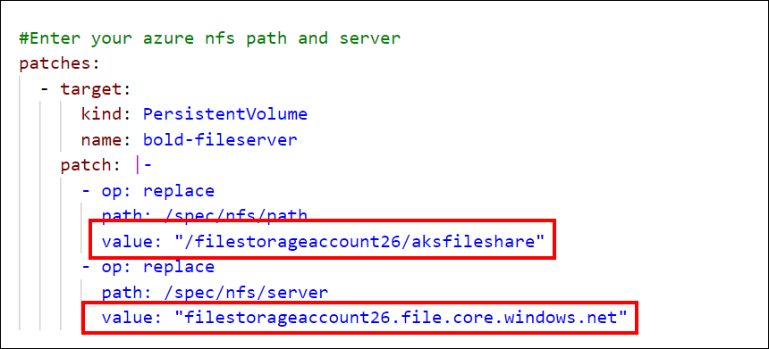

# Deploying Bold BI on Kubernetes
This section provides instructions on how to deploy Bold BI in different cloud cluster. Please follow the documentation below to successfully deploy the application.

## Prerequisites

- **[Install kubectl](https://kubernetes.io/docs/tasks/tools/#kubectl)**: Make sure you install kubectl on your local machine to facilitate the deployment process.
- **Kubernetes Cluster**([AKS](https://docs.microsoft.com/en-us/azure/aks/kubernetes-walkthrough-portal), [AWS](https://docs.microsoft.com/en-us/azure/aks/kubernetes-walkthrough-portal#connect-to-the-cluster), [GKE](https://console.cloud.google.com/kubernetes)): Create a cluster in which you want to deploy the Bold BI Application.
- **[Persistent Volume](PersistentVolumeCreation.md)**: Set up the necessary file storage for your Kubernetes clusters.
- **Load Balancer**: To configure Bold BI with Ingress, you need to install the [Nginx Ingress controller](https://kubernetes.github.io/ingress-nginx/deploy/) in your cluster
- **Database**: Create a Database to store metadata and intermediate data details of the Bold BI site 
- **Web Browsers**: The supported web browsers include Microsoft Edge, Mozilla Firefox, and Google Chrome.

Please ensure that you have fulfilled these prerequisites before proceeding with the deployment.

## Deployment using kubectl

1. Create and connect to a Kubernetes cluster to deploy Bold BI. Please refer to the table below for instructions on how to create and connect to a cluster on different cloud providers.

    | Cloud Providers            | Cluster Creation                                                                                    | Cluster Connection                                                                                      |
    |----------------------------|----------------------------------------------------------------------------------------------------|--------------------------------------------------------------------------------------------------------|
    | Azure Kubernetes Service   | [Azure AKS Walkthrough](https://docs.microsoft.com/en-us/azure/aks/kubernetes-walkthrough-portal) | [AKS Cluster Connection](https://docs.microsoft.com/en-us/azure/aks/kubernetes-walkthrough-portal#connect-to-the-cluster) |
    | Google Kubernetes Engine   | [Google GKE Console](https://console.cloud.google.com/kubernetes)                                | [GKE Cluster Connection](https://cloud.google.com/kubernetes-engine/docs/quickstart)                     |
    | Elastic Kubernetes Service | [AWS EKS Guide](https://docs.aws.amazon.com/eks/latest/userguide/create-cluster.html)             | [EKS Cluster Connection](https://aws.amazon.com/premiumsupport/knowledge-center/eks-cluster-connection/) |

2. Create a File share instance in your storage account and note the File share name to store the shared folders for application usage.

    | **Cloud Provider** | **Link** |
    |--------------------|----------|
    |  AKS File Storage | [Create an NFS file share instance](https://learn.microsoft.com/en-us/azure/storage/files/storage-how-to-use-files-portal?tabs=azure-portal) |
    |  EKS File System   | [Create an Amazon Elastic File System](https://docs.aws.amazon.com/efs/latest/ug/gs-step-two-create-efs-resources.html) |
    |  GKE File Store   | [Create a Google filestore instance](https://console.cloud.google.com/filestore) |

    Please ensure that you follow the provided links to set up the necessary file storage for your Kubernetes clusters.

3. Create a managed database or deploy it within the cluster as an alternative,  you can follow the guidelines provided by the respective cloud providers for PostgreSQL, MS SQL, and MySQL.

    | Cloud Provider | Database    | Reference Link                                                                                      |
    |----------------|-------------|----------------------------------------------------------------------------------------------------|
    | Azure          | PostgreSQL<br><br> MS SQL<br><br> MySQL | [Azure PostgreSQL Quickstart](https://learn.microsoft.com/en-us/azure/postgresql/flexible-server/quickstart-create-server-portal)<br><br>[MS SQL Quickstart](https://learn.microsoft.com/en-us/azure/azure-sql/database/single-database-create-quickstart?view=azuresql&tabs=azure-portal)<br><br> [MySQL Quickstart](https://learn.microsoft.com/en-us/azure/mysql/flexible-server/quickstart-create-server-portal) |
    | AWS            | PostgreSQL<br><br>MS SQL<br><br>MySQL | [PostgreSQL Quickstart](https://docs.aws.amazon.com/AmazonRDS/latest/UserGuide/CHAP_GettingStarted.CreatingConnecting.PostgreSQL.html)<br><br>[MS SQL Quickstart](https://docs.aws.amazon.com/AmazonRDS/latest/UserGuide/CHAP_GettingStarted.CreatingConnecting.SQLServer.html)<br><br> [MySQL Quickstart](https://docs.aws.amazon.com/AmazonRDS/latest/UserGuide/CHAP_GettingStarted.CreatingConnecting.MySQL.html) |
    | GCP            | PostgreSQL<br><br>MySQL<br><br>SQL Server | [PostgreSQL Quickstart](https://cloud.google.com/sql/docs/postgres/create-instance)<br><br>[MySQL Quickstart](https://cloud.google.com/sql/docs/mysql/create-instance)<br><br>[SQL Server Quickstart](https://cloud.google.com/sql/docs/sqlserver/create-instance) |

    These guides will provide you with step-by-step instructions on how to deploy a managed database on each respective cloud provider.

4.  Download the [Kustomization.yaml](https://github.com/sivakumar-devops/kustomization-improvement/tree/mohamed) file for deploying Bold BI in a Cluster. Ensure to choose the correct configuration for your specific requirement, whether it's for Azure Kubernetes Service (AKS), Amazon Elastic Kubernetes Service (EKS), or Google Kubernetes Engine (GKE).

5. Open the Kustomization.yaml file. Edit the File store Path value.

|File Storage                  | Action |
-------------------------------|-------------------------------|
| Azure File Share             | Replace the `storage account name and file share name` with `<storage_account_name>` and `<file_share_name>`, respectively, in the file.                                                               |
| GKE File Store               | Replace the `File share name and IP address` with `<file_share_name>` and `<file_share_ip_address>`, respectively, in the file.                                                                                               |
| Elastic File Storage for EKS | Replace the `File system ID` with `<efs_file_system_id>` in the file.                                                                                                                                                                          |


6. After connecting with your cluster, deploy the `latest Nginx ingress controller` to your cluster using the following command.
    ```bash 
    kubectl apply -f https://raw.githubusercontent.com/kubernetes/ingress-nginx/controller-v1.10.0/deploy/static/provider/cloud/deploy.yaml
    ```
 
    For more information about the load balancer installation, please refer to this [link](https://kubernetes.github.io/ingress-nginx/deploy/).

7. Run the following command to obtain the ingress IP address. If you want to use a domain name, map the external IP address obtained from the command below to the domain name in your DNS settings
    ```bash 
    kubectl get service/ingress-nginx-controller -n ingress-nginx

8. After obtaining the External IP address, replace the `app-base URL` with your External IP address or Domain name.
    

9. Navigate to the folder where the deployment file were downloaded from Step 4.
10. Run the following command to deploy Bold BI application on cluster
    ```bash
    kubectl apply -k .
11. Please wait for some time until the Bold BI  application is deployed to your cluster.

12. Use the following command to get the pods status.
    ```bash 
    kubectl get pods -n bold-services

13. Wait until you see the applications running. Then, use the DNS or ingress IP address you obtained from Step 7 to access the application in the browser.

