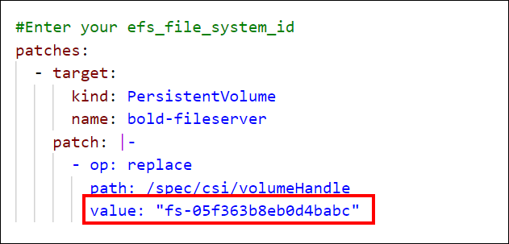
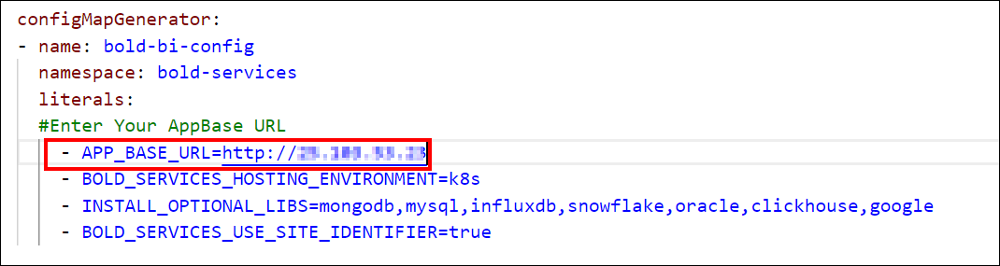

# Deploying Bold BI on Kubernetes

## Deployment Guidelines

### Prerequisites

1. [Install kubectl](https://kubernetes.io/docs/tasks/tools/#kubectl)
2. [Kubernetes Cluster](KubernetesClusterCreation.md)
3. [Persistent Volume](PersistentVolumeCreation.md)
4. [Load Balancer](Loadbalancer.md)
5. [Database](DatabaseCreation.md)
6. Web Browsers

- Microsoft Edge
- Mozilla Firefox
- Google Chrome

## Deployment using kubectl

1. Get the [Kustomization.yaml](https://github.com/sivakumar-devops/kustomization-improvement/tree/mohamed) file for deploying Bold BI in a Cluster. Ensure to choose the correct configuration for your specific requirement, whether it's for Azure Kubernetes Service (AKS), Amazon Elastic Kubernetes Service (EKS), or Google Kubernetes Engine (GKE).
2. Create a `Kubernetes cluster` to deploy Bold BI.
3. Create a `File share instance` in your storage account and note the File share name to store the shared folders for application usage.
4. Deploy a `managed database` or deploy it within the cluster as an alternative.
5. Open the Kustomization.yaml file that was downloaded in Step 1. Edit the File store Path value.

    |File Storage | Action | Image |
    |------|--------|-------|
    | Azure File Share    | Replace the `storage account name and file share name` noted in the steps above with <storageaccountname> and <file_share_name>, respectively, in the file. |  |
    |  GKE File Store   | Replace the `File share name and IP address` noted in above step to the <file_share_name> and <file_share_ip_address> places in the file. You can also change the storage size in the YAML file. Save the file once you replaced the file share name and file share IP address. |  |
    |  Elastic File Storage for EKS    |  Replace the `File system ID` noted in above step to the <efs_file_system_id> place in the file. |  |

6. `Connect` with your  cluster.

7. After connecting with your cluster, deploy the `latest Nginx ingress controller` to your cluster using the following command.
    ```bash 
    kubectl apply -f https://raw.githubusercontent.com/kubernetes/ingress-nginx/controller-v1.10.0/deploy/static/provider/cloud/deploy.yaml

8. Run the following command to obtain the ingress IP address.
    ```bash 
    kubectl get service/ingress-nginx-controller -n ingress-nginx

9. After obtaining the External IP address, replace the `app-base URL` with your External IP address.
    

10. Navigate to the folder where the deployment file were downloaded from Step 1.
11. Run the following command to deploy Bold BI application on AKS cluster
    ```bash
    kubectl apply -k .
12. Please wait for some time until the Bold BI On-Premise application is deployed to your Microsoft AKS cluster.

13. Use the following command to get the pods status.
    ```bash 
    kubectl get pods -n bold-services

14. Wait until you see the applications running. Then, use the DNS or ingress IP address you obtained from Step 8 to access the application in the browser.

